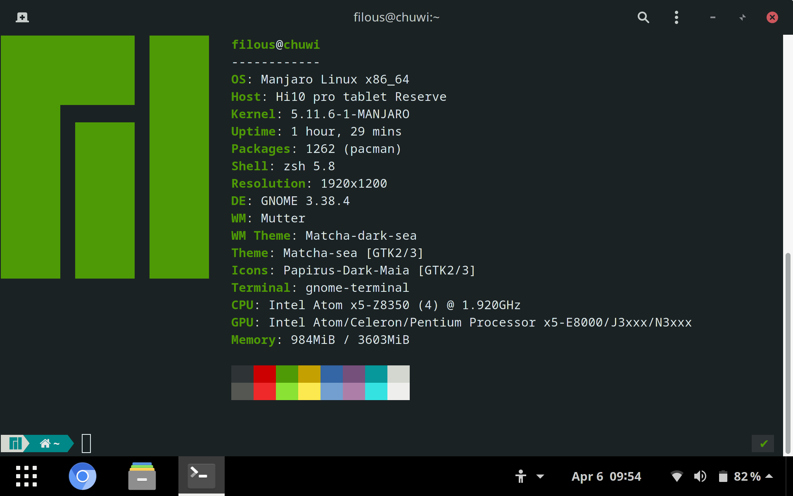
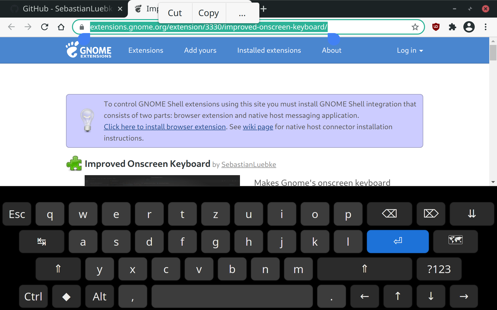
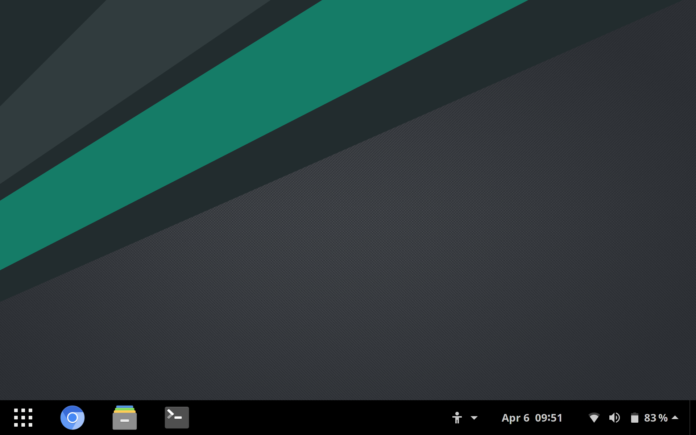
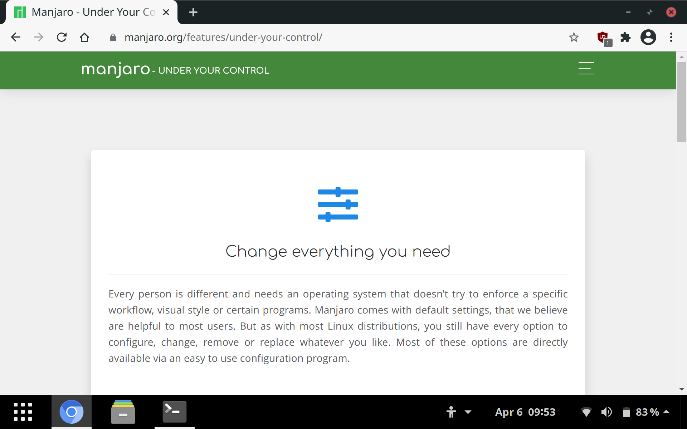
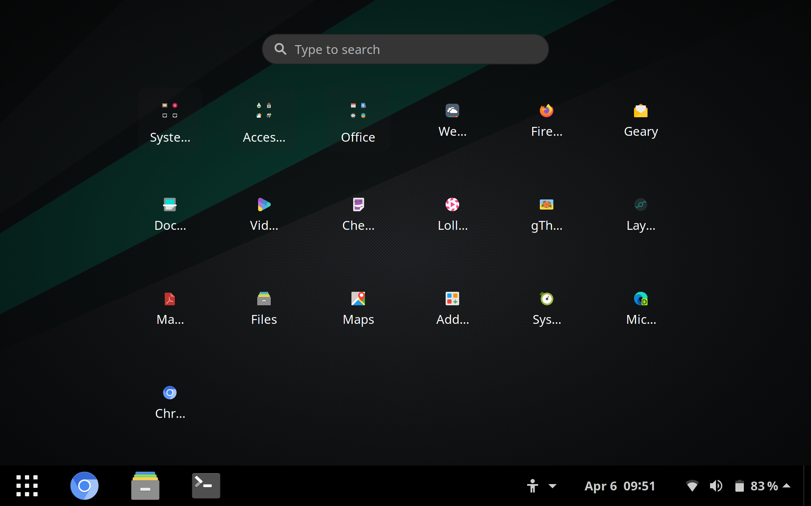
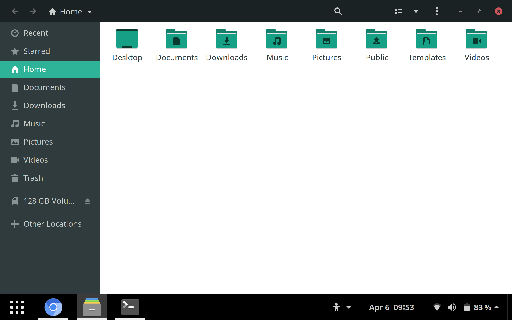

# Very useful links
[Gnome touchscreen tracker (bugs, features, ideas)](https://wiki.gnome.org/Design/OS/Touchscreen)  
[XDA Developers thread](https://forum.xda-developers.com/t/chuwi-hi10-air-linux-installation-guide.3915804/)



## Touch driver
### Get driver
Touch driver from root chuwi folder [onitake/gsl-firmware/tree/master](https://github.com/onitake/gsl-firmware/tree/master/firmware/chuwi) is not working for me, but in `driver/` is driver which works for me - taken from [onitake/gsl-firmware/blob/../gsl1680-chuwi-hi10-air.fw](https://github.com/onitake/gsl-firmware/blob/master/firmware/linux/silead/gsl1680-chuwi-hi10-air.fw)    

### Install touch driver
Copy to folder `/lib/firmware/silead/` with default name `mssl1680.fw`  
``` 
$ cd /lib/firmware/silead/  
# cp ~/Downloads/gsl1680-chuwi-hi10-air.fw mssl1680.fw
```

### [Correct driver rotation after log in for all users](https://help.gnome.org/admin/system-admin-guide/stable/autostart-applications.html.en)
Download `touch_rotation.sh`

Create a file in `/etc/xdg/autostart/` with the `.desktop` extension.

```
[Desktop Entry]
Name=ScreenRotation
GenericName=Screen Rotator
Comment=Screen rotation for Chuwi Hi10 Air
Exec=sh /<path_to>/touch_rotation.sh
Terminal=false
Type=Application
X-GNOME-Autostart-enabled=true
```

## GDM (Login screen)
### [Share screen setup with GDM](https://wiki.archlinux.org/index.php/GDM#Setup_default_monitor_settings)
Once you have set monitor preferences in system settings, you can copy this file for GDM, so you will have same orientation, and other settings as after login.  
__I was not able to run properly touch driver while on GDM__

```
# cp ~/.config/monitors.xml /var/lib/gdm/.config/
# chown gdm:gdm /var/lib/gdm/.config/monitors.xml
```

## Screen scalling
__Do not use fractational scalling__ <del>[like this](https://forum.manjaro.org/t/fractional-scaling-in-gnome/22195)</del> __whole shell is then slow and even when animations are turned off everyhitng is slower and does not feel comfortable on this tablet__

You wont get into issues with default scalling (100% or 200%), I'm using 200% and with some tweaks, it looks OK and is pretty stable and fast.
There is a bug when you use 200% scalling, icons are too small.
https://gitlab.gnome.org/GNOME/gnome-shell/-/issues/2173

## Virtual keyboard
OOTB gnome virtual keyboard works just fine.
But if you want something more complex, I am using [Improved Onscreen Keyboard](https://extensions.gnome.org/extension/3330/improved-onscreen-keyboard)


## Other
Desktop layout can be adjusted in __Layouts__, __Gnome Extensions__, and __Gnome Tweaks__ apps.

---
## Screenshots



