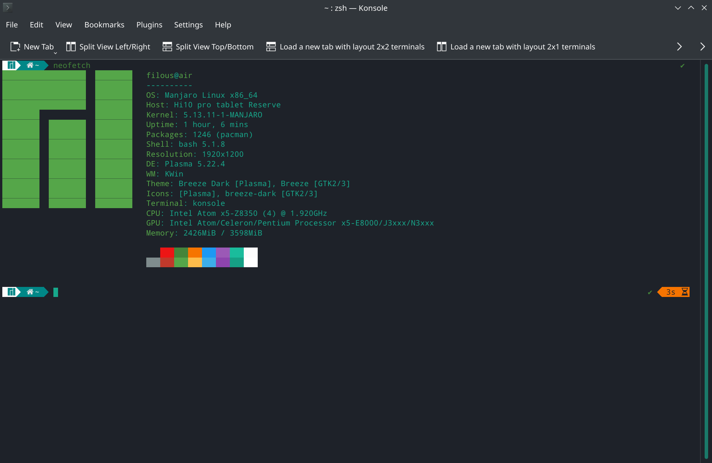

## What is new?
[Adventures in Linux and KDE](https://pointieststick.com/)

## Touch driver
### Get driver
Touch driver from root chuwi folder [onitake/gsl-firmware/tree/master](https://github.com/onitake/gsl-firmware/tree/master/firmware/chuwi) is not working for me, but in `driver/` is driver which works for me - taken from [onitake/gsl-firmware/blob/../gsl1680-chuwi-hi10-air.fw](https://github.com/onitake/gsl-firmware/blob/master/firmware/linux/silead/gsl1680-chuwi-hi10-air.fw)    

### Install touch driver
Install xinput of not installed

```
# pacman -Sy xorg-xinput
```

Copy to folder `/lib/firmware/silead/` with default name `mssl1680.fw`  
``` 
$ cd /lib/firmware/silead/  
# cp ~/Downloads/gsl1680-chuwi-hi10-air.fw mssl1680.fw
```

### Calibrate touchscreen
File `/etc/udev/rules.d/50-touchscreen.rules` [source](https://forum.xda-developers.com/t/chuwi-hi10-air-linux-installation-guide.3915804/page-7#post-81892559)

``` 
DRIVERS=="silead_ts" ENV{LIBINPUT_CALIBRATION_MATRIX}="2.1746 0 -0.0438 0 -3.2764 1.0048 0 0 1"
``` 

Currently I dont know how to rotate touchscreen with screen itself, while screen rotation works, touch calibration remains same for Landscape mode. So touch is not working properly and is locked to only one screen Orientation.

## Screen rotation
Install `iio-sensor-proxy-git` and `kded-rotation-git` from AUR. [source](https://wiki.archlinux.org/title/Tablet_PC#With_a_KDE_module)

Create `/lib/udev/hwdb.d/61-sensor-local.hwdb` with mount matrix, this works for me, adjust it as needed. 
```
# Chuwi Hi10 Air
sensor:modalias:acpi:BOSC0200*:dmi:*
 ACCEL_MOUNT_MATRIX=0, -1, 0; -1, 0, 0; 0, 0, 1
```

Now update config and trigger
```
# systemd-hwdb update 
# udevadm trigger -v -p DEVNAME=/dev/iio:device0
```

Reboot tablet and screen rotation should work

## Broken Audio output
When Screen rotation is set, it brokes audio output, sound works, but PulseAudio does not start. I've found an workaround since I am not using audio output devide via HDMI, then I simply disable kernel module which causes the problems. This seems to be related to Atom CPUs. [source](https://mailman.alsa-project.org/pipermail/alsa-devel/2017-March/118979.html)
[Module blacklisting](https://wiki.archlinux.org/title/Kernel_module#Blacklisting)

File `/etc/modprobe.d/blacklist.conf`
```
blacklist snd_hdmi_lpe_audio
```
Reboot and tablet speakers should be recognized again.

## Virtual keyboard
Onboard

## Other
Screen Scaling - 150%
Use "Application Dashboard" (full-screen) as app launcher
Disable Compositor on startup and set it to Smooth and Preffer Low Latency

---
## Screenshots

---
## Helpful links
[Arch Linux Docs](https://wiki.archlinux.org/title/Tablet_PC)
[Manjaro Forum Thread](https://archived.forum.manjaro.org/t/x64-x86-tablet-howto-draft-for-a-wiki-page-help-appreciated/121979/11)